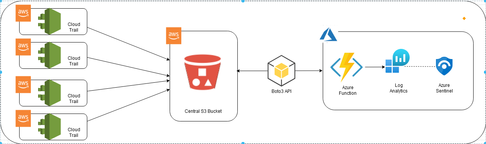

# Azure native Data connector to ingest AWS CloudTrail Logs
Azure native Sentinel Data connector to ingest AWS CloudTrail Logs

AWS CloudTrail logs are audit type events from all/any AWS resources in a tenancy. Each AWS resource has a unique set of Request and Response Parameters. Azure Log Analytics has a column per table limit of 500, (plus some system columns) the aggregate of AWS parameter fields will exceed this quickly leading to potential loss of event records

Code does the following things with the logs it processes. 
1.	Takes the core fields of the record. i.e. all fields except for the Request and Response associated fields and puts them in a LogAnalyticsTableName_ALL. Providing a single table with all records with core event information.	
2.	Looks at each event and puts it into a table with an extension <AWSREsourceType> i.e. LogAnalyticsTableName_S3 
3.	Exception to 2 above is for EC2 events, the volume of fields for EC2 Request and Response parameters exceeds 500 columns. EC2 data is split into 3 tables, Header, Request & Response. 
	Ex: LogAnalyticsTableName_EC2_Header
4.	In future if other AWS datatypes exceed 500 columns a similar split may be required for them as well. 

**Note**  

To avoid additional billing and duplication:
1. You can turn off LogAnalyticsTableName_ALL using additional Environment Variable **CoreFieldsAllTable** to **false**
2. You can turn off LogAnalyticsTableName_AWSREsourceType using additional Environment Variable **SplitAWSResourceTypeTables** to **false**

**Either CoreFieldsAllTable or SplitAWSResourceTypeTables must be true or both can be true**

## **Function Flow process**
**CloudTrail Logs --> AWS S3 --> Azure Function --> Azure Log Analytics**

## Installation / Setup Guide

